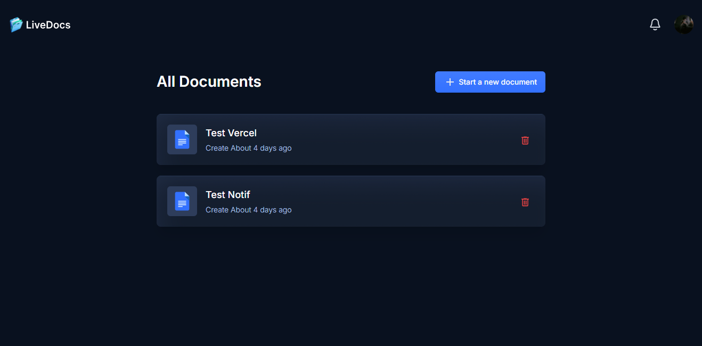
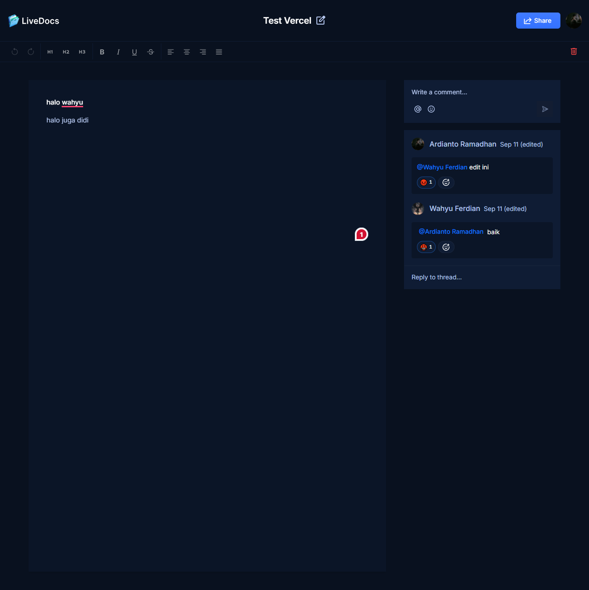

### Description

Built with Next.js to handle the user interface, Liveblocks for real-time features and styled with TailwindCSS, LiveDocs is a clone of Goole Docs.

### Tech-Stack

- Next.js
- TypeScript
- Liveblocks
- Lexical Editor
- ShadCN
- Tailwind CSS

### Features

**Authentication**: User authentication using GitHub through NextAuth, ensuring secure sign-in/out and session management.

 **Collaborative Text Editor**: Multiple users can edit the same document simultaneously with real-time updates.

  **Documents Management**
   - **Create Documents**: Users can create new documents, which are automatically saved and listed.
   - **Delete Documents**: Users can delete documents they own.
   - **Share Documents**: Users can share documents via email or link with view/edit permissions.
   - **List Documents**: Display all documents owned or shared with the user, with search and sorting functionalities.

**Comments**: Users can add inline and general comments, with threading for discussions.

**Active Collaborators on Text Editor**: Show active collaborators with real-time presence indicators.

**Notifications**: Notify users of document shares, new comments, and collaborator activities.

**Responsive**: The application is responsive across all devices.

### Quick-start

**Prerequisites**

Make sure you have the following installed on your machine:

- [Git](https://git-scm.com/)
- [Node.js](https://nodejs.org/en)
- [pnpm](https://pnpm.io/) (Node Package Manager)

**Cloning the Repository**

```bash
git clone https://github.com/ardianto29/KeepDoc.git
cd KeepDoc
```

**Installation**

Install the project dependencies using npm:

```bash
pnpm install
```

**Set Up Environment Variables**

Create a new file named `.env` in the root of your project and add the following content:

```env
#Clerk
NEXT_PUBLIC_CLERK_PUBLISHABLE_KEY=
CLERK_SECRET_KEY=
NEXT_PUBLIC_CLERK_SIGN_IN_URL=/sign-in
NEXT_PUBLIC_CLERK_SIGN_UP_URL=/sign-up

#Liveblocks
NEXT_PUBLIC_LIVEBLOCKS_PUBLIC_KEY=
LIVEBLOCKS_SECRET_KEY=
```

Replace the placeholder values with your actual Clerk & LiveBlocks credentials. You can obtain these credentials by signing up on the [Clerk](https://clerk.com/) and [Liveblocks](liveblocks.io/) website.

**Running the Project**

```bash
pnpm run dev
```

### Display



